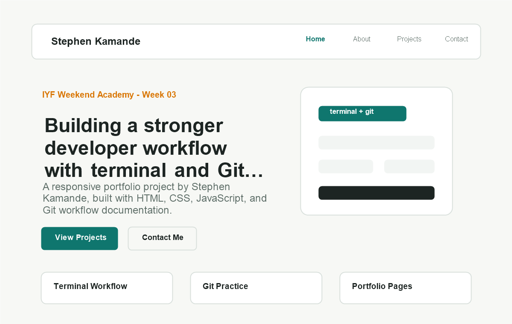

# Stephen Kamande - Week 03 Project

This repository is my Week 03 Tools & Workflow submission for the IYF Weekend Academy. It demonstrates terminal-based project setup, file operations, Git workflow practice, and a polished multi-page portfolio website.

## Live Demo

[View the live blue-themed portfolio](https://theecolboy.github.io/week-3-seasason-11-iyf/)

## Screenshot



## Features

- Responsive multi-page portfolio
- Accessible navigation, forms, labels, and focus states
- Polished blue visual theme with professional page copy
- Project cards and learning highlights
- Contact form layout
- Terminal and Git workflow documentation
- PowerShell and Bash project setup scripts

## Technologies Used

- HTML5
- CSS3
- JavaScript
- Git and GitHub
- PowerShell
- Bash

## Project Structure

```text
week-3-seasason-11-iyf/
|-- index.html
|-- about.html
|-- projects.html
|-- contact.html
|-- README.md
|-- LICENSE
|-- terminal-log.md
|-- daily-challenges.md
|-- git-workflow.md
|-- .gitignore
|-- css/
|   `-- styles.css
|-- js/
|   `-- main.js
|-- images/
|   |-- portrait.png
|   `-- screenshot.png
|-- docs/
|   `-- terminal-answers.md
|-- scripts/
|   |-- create-boilerplate.ps1
|   |-- new-project.ps1
|   `-- new-project.sh
`-- tests/
    `-- README.md
```

## What I Learned

This week I practiced navigating folders from the terminal, creating and moving files without using a file explorer, writing simple automation scripts, and using Git branches and commits to manage project changes.

## Future Improvements

- [ ] Add form submission with a backend service
- [ ] Add project filtering with JavaScript
- [ ] Add a dark mode toggle
- [x] Publish the site with GitHub Pages

## Contact

- Email: [kamandestephennd31@gmail.com](mailto:kamandestephennd31@gmail.com)
- GitHub: [@theecolboy](https://github.com/theecolboy)
- Repository: [week-3-seasason-11-iyf](https://github.com/theecolboy/week-3-seasason-11-iyf)

## License

This project is open source and available under the [MIT License](LICENSE).
